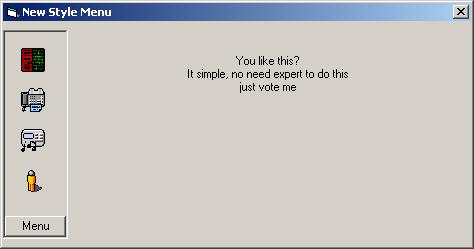



## New Style Menu

### Description

A group menu like Ms Access, it can scroll when you click the button. When you over the button it will enlarging the size with sound. No need an api, it was simple and good for basic of a beginer. Vote me if you like it.
 
### More Info
 

             |
---                |---
**Submitted On**   |2002-11-02 17:52:44
**By**             |[uud ashr](https://github.com/Planet-Source-Code/PSCIndex/blob/master/ByAuthor/uud-ashr.md)
**Level**          |Beginner
**User Rating**    |4.3 (17 globes from 4 users)
**Compatibility**  |VB 6\.0
**Category**       |[Custom Controls/ Forms/  Menus](https://github.com/Planet-Source-Code/PSCIndex/blob/master/ByCategory/custom-controls-forms-menus__1-4.md)
**World**          |[Visual Basic](https://github.com/Planet-Source-Code/PSCIndex/blob/master/ByWorld/visual-basic.md)
**Archive File**   |[New\_Style\_156805422003\.zip](https://github.com/Planet-Source-Code/uud-ashr-new-style-menu__1-44442/archive/master.zip)

